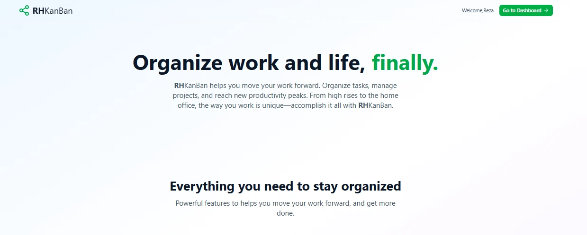
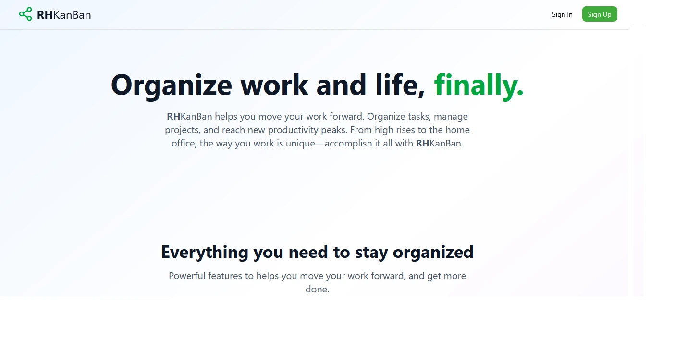
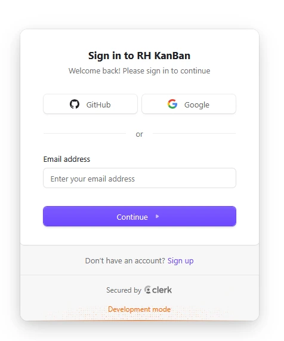
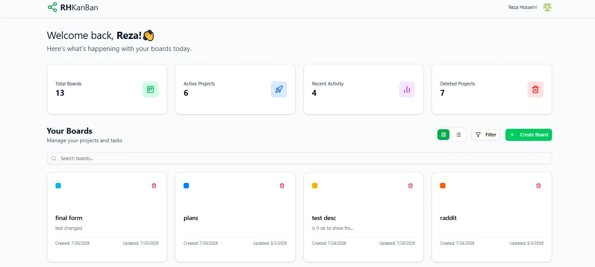
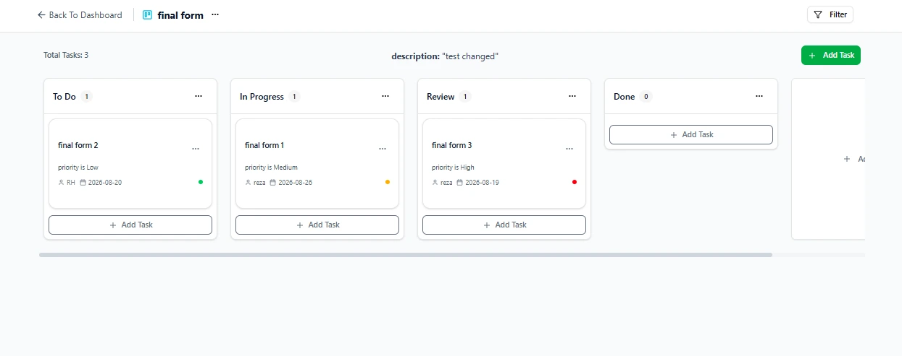
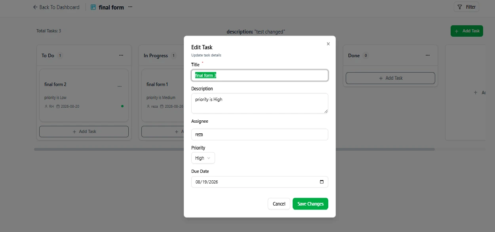
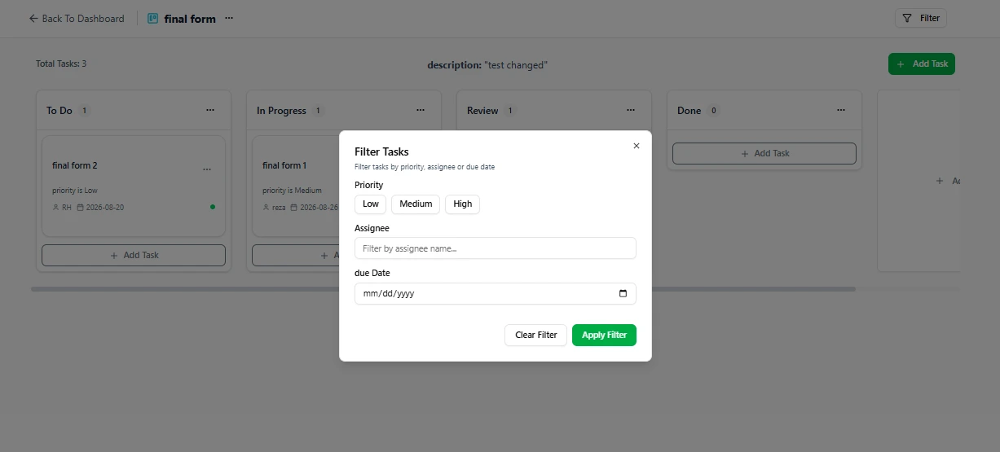

<div align="center">
   <h3 align="center">RH KanBan </h3>
   <br />

   <a href="https://rh-kanban.vercel.app" target="_blank">
      
   </a>

<br /><br />

   <div>
      
      
     
     
     
     
   </div>

   <br />

   <a href="https://rh-kanban.vercel.app" target="_blank">
      
   </a>
</div>

## 📋 <a name="table">Table of Contents</a>

1. ✨ [Introduction](#introduction)  
2. 🛠 [Tech Stack](#tech-stack)  
3. 🚀 [Features](#features)  
4. 📸 [Screenshots](#screenshots)
5. 🤸 [Quick Start](#quick-start)

---
## <a name="introduction">✨ Introduction</a>
RH KanBan is a modern, real-time task management platform designed to help users streamline their workflows, organize projects, and boost productivity. Built with Next.js, Supabase, Clerk, and dnd-kit, it provides seamless drag-and-drop interactivity, dynamic board controls, instant database sync across active clients, and secure multi-provider authentication.

## <a name="tech-stack">🛠 Tech Stack</a>
| Technology | Role |
| :--- | :--- |
| **[Next.js](https://nextjs.org/)** | React Framework with File-Based Routing & Server Components |
| **[Supabase](https://supabase.com/)** | Hosted Postgres, Real-Time Subscriptions & Storage |
| **[Clerk](https://clerk.com/)** | Authentication & User Management |
| **[dnd-kit](https://dndkit.com/)** | Flexible Drag-and-Drop Primitives |
| **[Tailwind CSS](https://tailwindcss.com/)** | Utility-First Styling Framework |
| **[TypeScript](https://www.typescriptlang.org/)** | Static Type Checking & Developer Tooling |

---

## <a name="features">🚀 Features</a>
### 🗂️ Board & Column Management
* **Board Control:** Create, rename, search, and delete custom boards to organize your projects.
* **Flexible Columns:** Easily add new columns or rename existing ones to fit your specific workflow.
* **Dynamic Tasks:** Add, edit, and delete tasks with rich metadata including title, description, assignee, priority, and due date.

### 🔄 Interactive Drag & Drop & Sync
* **Smooth Drag & Drop:** Reorder tasks and move them seamlessly between columns powered by `@dnd-kit`.
* **Real-Time Updates:** Live changes sync instantly across all active clients via Supabase subscriptions.

### 🔍 Search & Filtering
* **Board & Task Search:** Quickly search through all your boards and find specific tasks within a board.
* **Advanced Filtering:** Filter tasks by priority, due date, or search queries.

### 🔐 Authentication & Security
* **Social Authentication:** Secure and seamless sign-up/login powered by Clerk, supporting **GitHub** and **Google** OAuth providers.

### 📱 User Experience & UI
* **Fully Responsive:** Mobile-first, fully scalable design across desktop, tablet, and mobile devices using Tailwind CSS.
---
## <a name="screenshots">📸 Screenshots</a>
<div align="center">
  <table>
    <tr>
      <td width="50%">
        
        <p align="center"><b>🚀 Landing & Authentication Entry</b></p>
      </td>
      <td width="50%" align="center">
        
        <p align="center"><b>🔐 Social Auth via Clerk (Google/GitHub)</b></p>
      </td>
    </tr>
    <tr>
      <td width="50%">
        
        <p align="center"><b>📊 Kanban Board Dashboard</b></p>
      </td>
      <td width="50%">
        
        <p align="center"><b>📋 Tasks Overview </b></p>
      </td>
    </tr>
    <tr>
      <td width="50%">
        
        <p align="center"><b>✏️ Dynamic Task Editing</b></p>
      </td>
      <td width="50%">
        
        <p align="center"><b>🔍 Real-time Search & Filtering</b></p>
      </td>
    </tr>
  </table>
</div>

---

## <a name="quick-start">🤸 Quick Start</a>

Follow these steps to set up and run the project locally on your machine.

### 📋 Prerequisites
Ensure you have the following installed:
* [Git](https://git-scm.com/)
* [Node.js](https://nodejs.org/) (v18 or higher recommended)
* [npm](https://www.npmjs.com/) (Node Package Manager)
* [Supabase CLI](https://supabase.com/docs/guides/cli)
* Active Supabase project (URL & Anon Key)
* Clerk account (Publishable & Secret Keys)

### 🗄️ Database Setup (Supabase SQL)

<details>
<summary><b>Click to expand SQL Schema & RLS Policies</b></summary>

```sql
-- =========================================================
-- 0. Helper: get the requesting user's id from JWT
-- =========================================================
CREATE OR REPLACE FUNCTION requesting_user_id()
RETURNS text AS $$   SELECT NULLIF(     current_setting('request.jwt.claims', true)::json->>'sub',     ''   )::text; $$ LANGUAGE SQL STABLE;

-- =========================================================
-- 1. Tables
-- =========================================================

-- Boards
CREATE TABLE IF NOT EXISTS public.boards (
  id          bigint GENERATED BY DEFAULT AS IDENTITY PRIMARY KEY,
  created_at  timestamptz NOT NULL DEFAULT now(),
  updated_at  timestamptz NOT NULL DEFAULT now(),
  title       text NOT NULL,
  description text,
  color       text,
  user_id     text NOT NULL
);

-- Columns
CREATE TABLE IF NOT EXISTS public.columns (
  id          bigint GENERATED BY DEFAULT AS IDENTITY PRIMARY KEY,
  created_at  timestamptz NOT NULL DEFAULT now(),
  board_id    bigint NOT NULL REFERENCES public.boards(id) ON DELETE CASCADE,
  title       text NOT NULL,
  sort_order  int4 NOT NULL DEFAULT 0,
  user_id     text NOT NULL
);

-- Tasks
CREATE TABLE IF NOT EXISTS public.tasks (
  id          bigint GENERATED BY DEFAULT AS IDENTITY PRIMARY KEY,
  created_at  timestamptz NOT NULL DEFAULT now(),
  title       text NOT NULL,
  description text,
  assignee    text,
  due_date    date,
  priority    text,
  sort_order  int4 NOT NULL DEFAULT 0,
  column_id   bigint NOT NULL REFERENCES public.columns(id) ON DELETE CASCADE
);

-- Optional: keep boards.updated_at fresh
CREATE OR REPLACE FUNCTION public.set_updated_at()
RETURNS trigger AS $$ BEGIN   NEW.updated_at = now();   RETURN NEW; END; $$ LANGUAGE plpgsql;

DROP TRIGGER IF EXISTS trg_boards_updated_at ON public.boards;
CREATE TRIGGER trg_boards_updated_at
BEFORE UPDATE ON public.boards
FOR EACH ROW EXECUTE FUNCTION public.set_updated_at();

-- Helpful indexes
CREATE INDEX IF NOT EXISTS idx_columns_board_id ON public.columns(board_id);
CREATE INDEX IF NOT EXISTS idx_tasks_column_id  ON public.tasks(column_id);

-- =========================================================
-- 2. Enable Row Level Security
-- =========================================================
ALTER TABLE public.boards  ENABLE ROW LEVEL SECURITY;
ALTER TABLE public.columns ENABLE ROW LEVEL SECURITY;
ALTER TABLE public.tasks   ENABLE ROW LEVEL SECURITY;

-- =========================================================
-- 3. Policies
-- =========================================================

--------------------------
-- BOARDS TABLE POLICIES
--------------------------
CREATE POLICY "Users can view their own boards" ON public.boards
FOR SELECT USING (user_id = requesting_user_id());

CREATE POLICY "Users can insert their own boards" ON public.boards
FOR INSERT WITH CHECK (requesting_user_id() = user_id);

CREATE POLICY "Users can update their own boards" ON public.boards
FOR UPDATE USING (user_id = requesting_user_id()) WITH CHECK (user_id = requesting_user_id());

CREATE POLICY "Users can delete their own boards" ON public.boards
FOR DELETE USING (user_id = requesting_user_id());

--------------------------
-- COLUMNS TABLE POLICIES
--------------------------
CREATE POLICY "Users can view columns from their own boards" ON public.columns
FOR SELECT USING (
  EXISTS (SELECT 1 FROM public.boards WHERE boards.id = columns.board_id AND boards.user_id = requesting_user_id())
);

CREATE POLICY "Users can insert columns into their own boards" ON public.columns
FOR INSERT WITH CHECK (
  EXISTS (SELECT 1 FROM public.boards WHERE boards.id = columns.board_id AND boards.user_id = requesting_user_id())
);

CREATE POLICY "Users can update columns from their own boards" ON public.columns
FOR UPDATE USING (
  EXISTS (SELECT 1 FROM public.boards WHERE boards.id = columns.board_id AND boards.user_id = requesting_user_id())
) WITH CHECK (
  EXISTS (SELECT 1 FROM public.boards WHERE boards.id = columns.board_id AND boards.user_id = requesting_user_id())
);

CREATE POLICY "Users can delete columns from their own boards" ON public.columns
FOR DELETE USING (
  EXISTS (SELECT 1 FROM public.boards WHERE boards.id = columns.board_id AND boards.user_id = requesting_user_id())
);

-----------------------
-- TASKS TABLE POLICIES
-----------------------
CREATE POLICY "Users can view tasks from their own boards" ON public.tasks
FOR SELECT USING (
  EXISTS (
    SELECT 1 FROM public.columns JOIN public.boards ON boards.id = columns.board_id
    WHERE columns.id = tasks.column_id AND boards.user_id = requesting_user_id()
  )
);

CREATE POLICY "Users can insert tasks into their own boards" ON public.tasks
FOR INSERT WITH CHECK (
  EXISTS (
    SELECT 1 FROM public.columns JOIN public.boards ON boards.id = columns.board_id
    WHERE columns.id = tasks.column_id AND boards.user_id = requesting_user_id()
  )
);

CREATE POLICY "Users can update tasks from their own boards" ON public.tasks
FOR UPDATE USING (
  EXISTS (
    SELECT 1 FROM public.columns JOIN public.boards ON boards.id = columns.board_id
    WHERE columns.id = tasks.column_id AND boards.user_id = requesting_user_id()
  )
) WITH CHECK (
  EXISTS (
    SELECT 1 FROM public.columns JOIN public.boards ON boards.id = columns.board_id
    WHERE columns.id = tasks.column_id AND boards.user_id = requesting_user_id()
  )
);

CREATE POLICY "Users can delete tasks from their own boards" ON public.tasks
FOR DELETE USING (
  EXISTS (
    SELECT 1 FROM public.columns JOIN public.boards ON boards.id = columns.board_id
    WHERE columns.id = tasks.column_id AND boards.user_id = requesting_user_id()
  )
);
```
</details>

**⚠️ Warning: Fix Clerk Authentication & Supabase RLS Error (`22P02`)**

If you encounter `ERROR: 22P02: invalid input syntax for type uuid` when executing queries, replace `(auth.uid())::text` or `auth.uid()` in your RLS policies with:

```sql
requesting_user_id()
```
---

### 🚀 Getting Started

1. **Clone the Repository**
 ```bash
 git clone https://github.com/rezahosseini-dev/kanban-board.git
 cd kanban-board
 ```
2. **Install Dependencies**

```bash
npm install
```

3. **Configure Environment Variables**

Create a `.env` file in the root directory and set your credentials:
```env
NEXT_PUBLIC_CLERK_PUBLISHABLE_KEY=your_clerk_publishable_key
CLERK_SECRET_KEY=your_clerk_secret_key
NEXT_PUBLIC_SUPABASE_URL=your_supabase_url
NEXT_PUBLIC_SUPABASE_ANON_KEY=your_supabase_anon_key
```
4. **Start local Supabase emulation (optional):**

   ```bash
   supabase start
   supabase db push
   ```
5. **Run the Application**

```bash
npm run dev
```
Open [http://localhost:3000](http://localhost:3000) in your browser to view the project.

